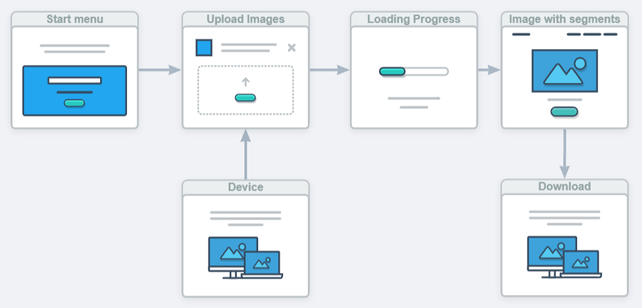

# Решение задачи сегментации рака на МРТ снимках

## О проекте:
Цель проекта --- разработать и/или улучшить существующие алгоритмы сегментации изображений. Поскольку в некоторых задачах ошибка в определении размера области очень играет важную роль(например, в предсказании размеров и положения раковой опухоли), то важно создание надежного алгоритма.

## Данные:
Для решения поставленной задачи можно воспользоваться набором данных с сайта kaggle с  [соответствующего соревнования](https://www.kaggle.com/datasets/mateuszbuda/lgg-mri-segmentation).

Организаторы соревнования предоставляют МРТ снимки головного мозга и маски с размерами раковых опухолей. Всего имеется 110 пациентов со средним числом снимков в 20 штук. Этих данных достаточно, чтобы обучить нейросеть из нескольких слоев.

## Подход:
Планируется применить модели, которые используются для решения задач сегментации, а именно: сверточные нейронные сети, Unet, SAM. Реализация будет производиться с применением библиотеки PyTorch.

## Как будет оформлено:
Приложение на компьютере, в которое можно загрузить снимок мозга и получить маску с обнаруженной областью, с возможностью его скачивания.

